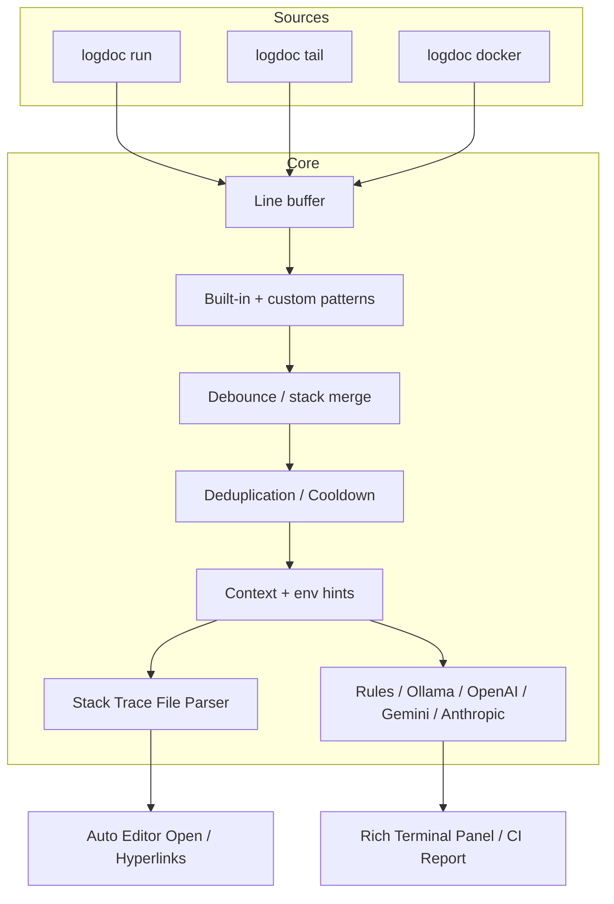

# LogDoc 🕵️‍♂️

**Prompt-driven CLI debugger** — run commands, tail log files, or follow Docker containers. LogDoc intercepts stdout/stderr in real time, debounces stack traces, detects failures via heuristics, and suggests local or cloud AI fixes directly in your terminal. 

Now supports local rules, **Ollama** models, **OpenAI**, **Anthropic Claude**, **Google Gemini**, automated **code jumping**, and native **CI/CD reporting**!

---

## 🌟 Key Features

* **⚡ Real-time Stream Interceptor**: Wraps any command (`npm run dev`, `python`, etc.), tails log files, or hooks into `docker logs -f`.
* **🧠 Multi-Provider AI Advisor**: Get tailored fixes using local **Ollama** (e.g. `llama3.2`), or cloud **OpenAI**, **Anthropic**, and **Gemini** models.
* **🛡️ Smart Debounce & Cooldown**: Groups multi-line stack traces into single incidents (no spam per line) and rate-limits repeating errors.
* **🔗 Code Jump & Editor Integration**: Renders clickable file path hyperlinks in the terminal. Optionally, automatically opens VS Code or Cursor at the exact line of the failure.
* **📊 CI/CD Summary Reports**: Set `--ci` to auto-generate rich Markdown summaries directly in GitHub Actions (`$GITHUB_STEP_SUMMARY`) or a local report file.
* **🔄 Seamless Log Rotation**: Automatically detects file truncations and rotations (inode changes) during `logdoc tail` and reopens handles without missing lines.

---

## 🚀 Quick Start

### 1. Install

Requires **Python 3.11+**.

```bash
cd logdoc
pip install -e .
```

### 2. Initialize Config

Create a customizable configuration template in `~/.logdoc.toml`:
```bash
logdoc init
```

### 3. Usage Examples

```bash
# Run any command and diagnose failures on the fly
logdoc run --ai -- python -c "raise ValueError('Database connection down')"

# Run via system shell (highly recommended on Windows for npm/yarn scripts)
logdoc run --ai --shell "npm run dev"

# Follow a log file (auto-reopens on logrotate/truncation)
logdoc tail ./logs/app.log --ai

# Run in CI/CD mode (writes markdown summaries in GitHub Actions summary or logdoc-report.md)
logdoc run --ci -- python -c "raise ValueError('Critical failure')"

# Check connection to your local Ollama instance
logdoc check-ollama
```

---

## 🛠️ Configuration (`logdoc.toml` / `~/.logdoc.toml`)

LogDoc loads configuration in order of precedence:
1. `~/.logdoc.toml` (Global user defaults)
2. `./logdoc.toml` (Local project overrides)
3. CLI flags (e.g. `--ai`, `--model`, `--ci`)

### Configuration Template

```toml
[ai]
provider = "ollama"  # Options: ollama | openai | anthropic | gemini
url = "http://127.0.0.1:11434" # Custom endpoint (or Ollama url)
model = "llama3.2"   # e.g., "gpt-4o-mini", "claude-3-5-sonnet-20241022", "gemini-1.5-flash"
api_key = ""         # Put your API key here (or set OPENAI_API_KEY / ANTHROPIC_API_KEY / GEMINI_API_KEY env vars)

[watch]
context_before = 8      # Lines to show before the error
context_after = 4       # Lines to show after the error
debounce_seconds = 0.6  # Time to wait to merge stack traces
buffer_maxlen = 200     # Internal rolling log line buffer size
passthrough = true      # Print logs in real time
cooldown_seconds = 30.0 # Ignore repeating identical errors for X seconds

[editor]
cmd = "code -g"         # CLI command to open file:line (e.g. "code -g" for VS Code, "cursor -g" for Cursor)
auto_open = false       # Automatically open the editor when a local file is parsed in a stack trace

[[patterns]]
name = "my-service-down"
kind = "network"
regex = "MyServiceUnavailable|SERVICE_UNAVAILABLE"
```

---

## 📊 How It Works



1. **Log Streaming**: Lines are captured from processes, tail streams, or docker logs and stored in a rolling `LineBuffer`.
2. **Detection**: Heuristics in `ErrorDetector` identify exceptions.
3. **Debouncing & Deduplication**: Multi-line stack traces are merged. Cooldown filters out repetitive warnings.
4. **Context Gathering**: Captures environmental variables (redacted for security) and surrounding log lines.
5. **Jump to Code**: Evaluates stack trace lines, finds local files, outputs clickable links, and opens the configured editor.
6. **AI Analysis**: Sends context to the selected AI provider (Ollama, OpenAI, Gemini, or Claude) or falls back to static rule-based suggestions.

---

## 💻 Windows Notes

- Use `logdoc run --shell "npm run dev"` for batch/shell one-liners.
- If executing batch files directly (`npm`, `pip`, etc.) without `--shell`, LogDoc automatically resolves their path using `shutil.which`.
- For inline commands, use double dash `--` to separate arguments: `logdoc run -- python -c "..."`

---

## 🧪 Tests

Run automated tests via:
```bash
python -m pytest
```

---

## 📄 License

MIT
