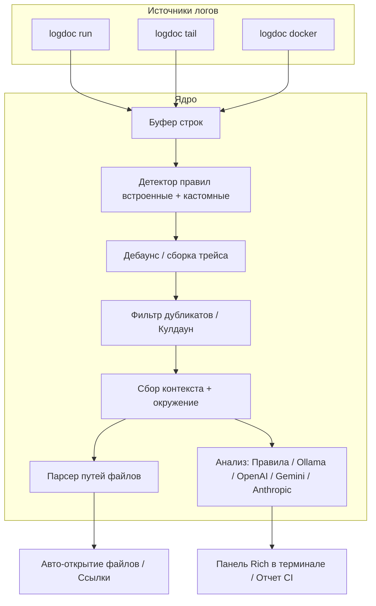

# LogDoc 🕵️‍♂️

**Интеллектуальный CLI-отладчик логов** — запускайте команды, отслеживайте файлы или логируйте Docker-контейнеры. LogDoc перехватывает потоки `stdout/stderr` в реальном времени, группирует стек-трейсы, находит ошибки с помощью эвристики и выводит советы по их исправлению прямо в терминал с помощью локальных правил или искусственного интеллекта.

Включает поддержку локального **Ollama**, облачных ИИ-моделей **OpenAI**, **Anthropic Claude**, **Google Gemini**, автоматического **перехода к коду (Code Jump)** и **интеграции с CI/CD**!

---

## 🌟 Основные возможности

* **⚡ Перехват логов в реальном времени**: Работает как обертка над любыми командами (`npm run dev`, `python` и др.), читает файлы логов или подключается к `docker logs -f`.
* **🧠 Мультипровайдерный ИИ-помощник**: Генерация советов через локальный **Ollama** (например, `llama3.2`) или через облачные API **OpenAI**, **Anthropic** и **Gemini**.
* **🛡️ Умный дебаунс и кулдаун**: Объединяет многострочные стек-трейсы в один инцидент (без спама на каждую строчку лога) и блокирует вывод одинаковых повторяющихся ошибок с помощью тайм-аута (cooldown).
* **🔗 Интеграция с редактором (Code Jump)**: Выводит кликабельные ссылки на файлы в терминале. Автоматически открывает VS Code или Cursor на нужной строке файла при обнаружении сбоя.
* **📊 Отчеты для CI/CD**: Флаг `--ci` генерирует красивые Markdown-отчеты об ошибках и рекомендациях напрямую в отчеты GitHub Actions (`$GITHUB_STEP_SUMMARY`) или в локальный файл.
* **🔄 Бесшовная ротация файлов**: В режиме слежения (`logdoc tail`) автоматически реагирует на ротацию логов (смена inode) и очистку файлов (обрезание до 0 байт), переоткрывая дескриптор.

---

## 🚀 Быстрый старт

### 1. Установка

Требуется **Python 3.11+**.

```bash
cd logdoc
pip install -e .
```

### 2. Создание файла конфигурации

Инициализируйте глобальные настройки по умолчанию (создастся файл `~/.logdoc.toml`):
```bash
logdoc init
```

### 3. Примеры использования

```bash
# Запуск команды и диагностика ошибок на лету с помощью ИИ
logdoc run --ai -- python -c "raise ValueError('Database connection down')"

# Запуск через системный shell (рекомендуется для скриптов npm/yarn на Windows)
logdoc run --ai --shell "npm run dev"

# Слежение за файлом логов (авто-переоткрытие при ротации)
logdoc tail ./logs/app.log --ai

# Запуск в режиме CI/CD (запись Markdown-отчета в GitHub Actions или logdoc-report.md)
logdoc run --ci -- python -c "raise ValueError('Critical failure')"

# Проверка соединения с локальным Ollama
logdoc check-ollama
```

---

## 🛠️ Настройка (`logdoc.toml` / `~/.logdoc.toml`)

Конфигурация загружается в следующем порядке:
1. `~/.logdoc.toml` (Глобальные настройки пользователя)
2. `./logdoc.toml` (Локальные переопределения проекта)
3. CLI Флаги (например, `--ai`, `--model`, `--ci`)

### Пример конфигурационного файла

```toml
[ai]
provider = "ollama"  # Доступно: ollama | openai | anthropic | gemini
url = "http://127.0.0.1:11434" # URL для Ollama или кастомный эндпоинт
model = "llama3.2"   # Например: "gpt-4o-mini", "claude-3-5-sonnet-20241022", "gemini-1.5-flash"
api_key = ""         # Ваш API ключ (или задайте переменные среды OPENAI_API_KEY / ANTHROPIC_API_KEY / GEMINI_API_KEY)

[watch]
context_before = 8      # Кол-во строк лога до ошибки
context_after = 4       # Кол-во строк лога после ошибки
debounce_seconds = 0.6  # Время ожидания конца стек-трейса
buffer_maxlen = 200     # Размер кольцевого буфера строк
passthrough = true      # Дублировать лог в консоль в реальном времени
cooldown_seconds = 30.0 # Игнорировать дубликаты одной ошибки в течение X секунд

[editor]
cmd = "code -g"         # Команда открытия файла (например, "code -g" для VS Code или "cursor -g" для Cursor)
auto_open = false       # Автоматически открывать редактор при обнаружении локального файла в ошибке

[[patterns]]
name = "my-service-down"
kind = "network"
regex = "MyServiceUnavailable|SERVICE_UNAVAILABLE"
```

---

## 📊 Как это работает



1. **Перехват логов**: Строки считываются из запущенных процессов, файлов или контейнеров и попадают в кольцевой `LineBuffer`.
2. **Детектирование**: Эвристические правила в `ErrorDetector` находят строки с ошибками.
3. **Группировка и фильтрация**: Многострочные стек-трейсы собираются воедино. Механизм кулдауна отфильтровывает частые повторяющиеся логи.
4. **Сбор контекста**: LogDoc собирает строки лога до и после ошибки, а также переменные окружения (безопасно скрывая пароли и токены).
5. **Code Jump**: Анализирует стек-трейс, находит локальные файлы проекта, генерирует кликабельные ссылки для терминала и открывает редактор кода.
6. **Анализ ИИ**: Отправляет собранные данные выбранному ИИ-провайдеру (Ollama, OpenAI, Gemini, Claude) или использует быстрые встроенные подсказки.

---

## 💻 Особенности работы на Windows

- Используйте команду `logdoc run --shell "npm run dev"` для запуска npm/yarn скриптов.
- При вызове бинарных файлов напрямую (`npm`, `pip` и т.д.) без флага `--shell` LogDoc автоматически определит их реальные пути на Windows с помощью `shutil.which`.
- Для явного разделения аргументов команды используйте двойное тире: `logdoc run -- python -c "..."`

---

## 🧪 Тестирование

Запуск автоматических тестов:
```bash
python -m pytest
```

---

## 📄 Лицензия

MIT
